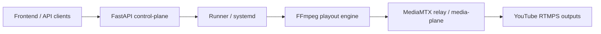

# Architecture Documentation

## System Overview

The YouTube Multi-Channel Streaming Service is a self-hosted web application that enables 24/7 streaming to multiple YouTube channels simultaneously without transcoding.

## High-Level Architecture

```
┌─────────────────────────────────────────────────────┐
│                   CLIENT BROWSER                     │
│              (Next.js 15 + React 19)                 │
└────────────────┬────────────────────────────────────┘
                 │ HTTPS
                 ▼
┌─────────────────────────────────────────────────────┐
│              CADDY (Reverse Proxy)                   │
│         • Auto HTTPS (Let's Encrypt)                 │
│         • SSL Termination                            │
└────────┬────────────────────────────────────────────┘
         │
    ┌────┴────┐
    ▼         ▼
┌─────────┐ ┌──────────────────────────────────────┐
│ Next.js │ │        FastAPI Backend               │
│Frontend │ │  • REST API                          │
│   :3000 │ │  • WebSocket + polling-owned status  │
└─────────┘ │  • Scheduler + FFmpeg control        │
            │  • File Validator (ffprobe)          │
            └───────┬──────────────┬──────────────┘
                    │              │
                    ▼              ▼
               ┌──────────────┐     ┌────────┐
               │ Supabase Auth │     │  tusd  │
               │ (JWT verify)  │     │Resumable│
               └──────┬───────┘     │ Upload  │
                      │             └────────┘
                      ▼
               ┌──────────────┐
               │ PostgreSQL    │
               │ (app data)    │
               └──────┬───────┘
                      │ systemctl / unit status
                      ▼
            ┌──────────────────────────┐
            │  Runner (systemd unit)   │
            │  • python -m app.cli...  │
            └──────────┬───────────────┘
                       ▼
               ┌─────────────┐
               │FFmpeg Workers│
               │(tee muxer)  │
               └──────┬──────┘
                      ▼
       ┌──────────────────────────┐
       │  RTMPS → YouTube Channels│
       │  • Channel 1             │
       │  • Channel 2             │
       │  • Channel N             │
       └──────────────────────────┘
```

## Core Components

### 1. Frontend (Next.js 15)

**Technology Stack:**
- Next.js 15 with App Router
- React 19 Server Components
- TypeScript
- Tailwind CSS
- TanStack Query for state management

**Key Features:**
- Server-side rendering for better SEO
- Polling-first live-status ownership on dashboard surfaces
- Tokenized WebSocket transport remains available for explicit status/log flows and follow-up cleanup
- Responsive dashboard with system metrics
- Drag-and-drop playlist editor
- `/dashboard/library` lazy-loads the upload modal so the page shell stays light.

**Pages:**
- `/` - Landing page
- `/login` - Authentication
- `/dashboard` - Dashboard with active streams and metrics
- `/dashboard/library` - Video/audio files, folders, playlists, uploads
- `/dashboard/streaming` - Stream control, channels, logs, and live operations
- `/dashboard/schedule` - Calendar-style schedule planning and upcoming stream events
- `/dashboard/plans` - Plan and quota management
- `/dashboard/profile` - Account settings and YouTube connection management

### 2. Backend (FastAPI)

**Technology Stack:**
- FastAPI (Python 3.12+)
- Pydantic for data validation
- SQLAlchemy for database ORM
- asyncio for process management
- psutil for system monitoring

**Core Modules:**

#### API Routes (`app/api/routes/`)
- С thin-ендпоінти, що лише приймають HTTP-запит, роблять базову валідацію та делегують роботу у відповідний сервіс. Це спрощує тестування й дає можливість повторно використовувати логіку в CLI/скриптах.
- `app.core.database.get_db()` is a request-scoped session dependency that does not commit on success; `get_db_context(commit_on_success=True)` is the explicit commit-capable seam for background jobs and other managed workflows.

#### Service Layer (`app/services/`)
- `admin/` — `AdminService`, audit логіка, робота з алертами, моніторинг стрімів.
- `assets/` — `AssetService`, `AssetUploadService`, токени завантажень та інтеграція з валідатором, quota-хелпери; delete повертає 409+usage якщо asset використовується, UI не показує force delete (MVP).
- `destinations/` — `DestinationService`. Шифрування ключів, quota-перевірки, маскування.
- `media_folders/` та `media_collections/` — інкапсульований CRUD для бібліотеки, включно з bulk-операціями та валідацією активів.
- `playlists/` — `PlaylistService`, що поєднує квоти, валідацію активів і `PlaylistBuilder`.
- `streams/` — `StreamService` + `StreamControlService`, які розділяють створення конфігурацій та керування FFmpeg/quotas.
- `quota/` — `QuotaService` для tusd-хуків і клієнтських запитів.
- `api/deps.py` — `require_user` гарантує наявність `user_profiles` і підхоплює timezone з `X-User-Timezone` (IANA).

#### Streaming Engine (`app/streaming/`)
- `validator.py` - FFprobe-based video validation
- `ffmpeg_manager.py` - Process lifecycle management
- `playlist_builder.py` - Concat demuxer file generation
- `command_builder.py`, `hot_swap.py`, `process_support.py`, and `runtime_signals.py` hold extracted helper seams for FFmpeg command assembly, runtime handoffs, process helpers, and degraded-state signals.

**Key Features:**
- Asynchronous FFmpeg process management (через `StreamControlService` + `ffmpeg_manager`)
- REST-first control plane with polling-owned dashboard freshness
- WebSocket endpoint available for explicit live-status/log consumers and follow-up transport cleanup
- Моніторинг ресурсів / reconciliation (`app/core/stream_reconciler.py`)
- Graceful shutdown + auto-restart via `systemd`

#### Current UI live-status owner map
- `frontend/src/components/layout/DashboardShell.tsx` is cache-consumer only and does not own stream refresh.
- `frontend/src/app/dashboard/page.tsx` owns dashboard overview freshness for `['streams', userId]`.
- `frontend/src/app/dashboard/streaming/page.tsx` owns streaming-management freshness for `['streams', userId]`.
- Per-stream status calls are bounded to explicit detail contexts rather than unconditional fan-out across overview surfaces.

### 3. Runner (systemd)

Production runtime тепер орієнтований на host-native `systemd` units:

- API лишається control-plane і викликає лише `start/stop/status`
- `ffmpeg@<stream_id>` unit лишається єдиним owner process lifecycle і restart policy
- runner (`python -m app.cli.run_stream`) лише запускає FFmpeg і пише heartbeat
- DB lease/heartbeat залишаються diagnostics/ownership signals, а не окремим restart orchestrator

Для tranche-one production-ish rollout підтримувана топологія лишається
**all-in-one node**: `frontend + backend + postgres + redis + tusd + ffmpeg@ +
uploads` на одному хості. Ранній split між backend і media host поки що
небезпечний, бо upload finalization, локальна валідація, thumbnail generation і
stream prep все ще очікують asset як локальний файл на backend host.

Це означає, що поточний runtime вже не є "one process kills all streams", але ще
не є повною stream isolation. Відмова хоста, локального storage path, disk
pressure або shared backend/media storage все ще залишається single-host blast
radius для всієї ноди.

### 4. FFmpeg Streaming Engine

**Core Strategy:**
```bash
ffmpeg -re -f concat -safe 0 -i playlist.txt \
  -c copy \
  -f tee \
  "[onfail=ignore:f=fifo:fifo_format=flv:attempt_recovery=1]rtmps://channel1|\
   [onfail=ignore:f=fifo:fifo_format=flv:attempt_recovery=1]rtmps://channel2"
```

**Key Components:**
- `-re` - Read at native frame rate (real-time)
- `-c copy` - Stream copy (NO transcoding)
- `tee` muxer - Multiple outputs from single input
- `fifo` muxer - Automatic recovery on network failures
- `onfail=ignore` - One bad destination should not automatically abort the entire stream

**Advantages:**
- Low CPU usage (no encoding)
- Single process per playlist
- Automatic reconnection on network issues
- Scalable to multiple channels

### 5. Database (PostgreSQL: self-host / local)

> У поточному стеку Supabase використовується для **автентифікації** (JWT), а
> основні дані застосунку живуть у PostgreSQL (локально або на VPS).

```sql
user_profiles (synced on first login)
  ├─ assets
  ├─ playlists
  │   └─ playlist_items
  ├─ media_folders
  ├─ media_collections
  │   └─ collection_items
  ├─ destinations
  └─ streams
      ├─ stream_destinations
      ├─ stream_assets
      └─ stream_events
```

**Security:**
- User isolation (backend checks `user_id` from Supabase JWT)
- Encrypted stream keys
- Secure token-based authentication

### 6. File Upload (tusd)

**Technology:**
- tus resumable upload protocol
- Docker containerized
- Webhook on upload completion

**Flow:**
1. Client uploads file via Uppy+tus
2. tusd saves to disk
3. Webhook triggers backend validation
4. FFprobe analyzes compatibility
5. Metadata stored in database

The frontend tusd helper in `frontend/src/lib/tusd.ts` normalizes the configured tusd origin so `/files/` is appended exactly once. Point `NEXT_PUBLIC_TUSD_URL` at the tusd origin itself, not a pre-suffixed path.

**Current storage contract (Phase 1 seam):**
- `assets.storage_path` still points to the local file/cache path used by validation, playlist prep and FFmpeg launch
- `assets.storage_backend` is additive and defaults to `filesystem`
- `assets.storage_key` is reserved for future object-storage identity
- `object_storage` rows are allowed in the data model, but stream prep still requires a hydrated local file; if cache is missing, runtime fails closed instead of silently using a broken path

### 7. Observability & Monitoring

- **Structured logging** — все сервисы используют `app.core.logging_config` (JSON + masking). Дополнительный middleware `APIMetricsMiddleware` снимает длительность/статус каждого HTTP-запроса и пишет их в кореллируемые логи.
- **Metrics Registry** — `app.core.metrics` агрегирует счётчики/гистограммы (streams, API, quotas, uploads). Экспорт доступен в двух форматах:
  - `/api/metrics` — агрегированная статистика по CPU/RAM/disk + активным стримам и эвристическая оценка пропускной способности; блок capacity не должен считаться production-grade источником истинной безопасной вместимости без измеренных workload-профилей.
  - `/api/metrics/prometheus` — текстовый экспорт в формате Prometheus (`text/plain; version=0.0.4`).
- **FFmpeg telemetry** — `FFmpegStreamManager` вызывает `track_stream_start`, `track_stream_stop` и `track_stream_error`, поэтому Active Streams gauge и гистограмма длительности отражают реальные процессы (включая auto-restart сценарии). Поверх этого degraded-live runtime сигналы (повторные remote output reset, recovery storm, repeated Non-monotonic DTS) пишутся в `stream_events` и `system_alerts`, а `runtime_incident_summary` у stream status/list собирается из shared runtime evidence: local in-memory manager state, shared log tail и recent persisted alerts.
- **Frontend hooks** — Dashboard и Streaming builder читают `/api/metrics` и отображают квоты/алерты; Jest тесты (`asset-display-info`, `builder-helpers`) проверяют логику отображения предупреждений и редакторов.

## Data Flow

### Stream Start Flow

```
1. User clicks "Start Stream" on frontend
   ↓
2. Frontend → POST /api/streams/{id}/start
   ↓
3. Backend validates playlist and destinations
   ↓
4. PlaylistBuilder prepares video/audio concat playlists (loop/shuffle aware, placeholders when required)
   ↓
5. FFmpegManager builds command per mix mode (video-only, audio-only, mixed) with copy-first fallback to transcode
   ↓
6. Spawns FFmpeg process (asyncio.subprocess)
   ↓
7. Process monitored in background task
   ↓
8. Frontend refreshes the owned stream list for its current route surface; explicit log/detail paths can use dedicated polling or WebSocket transport
   ↓
9. Stream status updated in database
```

### Video Upload Flow

```
1. User selects video file
   ↓
2. Uppy chunks and uploads to tusd
   ↓
3. tusd saves chunks, reassembles file
   ↓
4. tusd webhook → POST /api/assets/upload-complete
   ↓
5. Backend runs ffprobe validation
   ↓
6. Metadata extracted and stored
   ↓
7. Compatibility flag set (OK/Not OK for copy)
   ↓
8. Frontend updates asset list
```

## Scaling Strategy

### Current MVP (Single Server)

- **Capacity:** ~5-10 simultaneous streams (depends on bandwidth)
- **Bottleneck:** Network bandwidth (not CPU)
- **Estimation:** `available_bandwidth / (stream_bitrate × channels)`
- **Recommended launch topology:** one all-in-one node for tranche one
- **Why not split backend from media yet:** upload finalization, validation, thumbnail generation, and stream prep still expect the asset to exist on the backend host as a local file
- **Do not do yet:** do not add multiple runner nodes before object storage becomes the canonical asset source
- **Operational caveat:** this topology is still single-host by blast radius; host, disk, or shared storage failures can still impact every stream on the node

### Future Horizontal Scaling

1. **Worker Nodes:**
   - Separate FFmpeg workers on different servers
   - Queue-based distribution
   - Central API orchestrator

2. **Load Balancing:**
   - Caddy with multiple backends
   - Health checks and failover
   - Geographic distribution

3. **Storage:**
   - S3-compatible object storage
   - CDN for static assets
   - Distributed caching

Recommended order:
1. Launch on one all-in-one node.
   Treat it as the simplest supported topology, not as full stream isolation.
2. Move uploads and asset origin to S3/MinIO-backed object storage.
3. Add runner placement and horizontal media scaling.
4. Add MediaMTX only if relay or observability needs justify the extra layer.

## Security Considerations

### Authentication
- Supabase Auth with email/social logins
- JWT tokens with expiration
- Session management

### Authorization
- Row Level Security (RLS) in database
- User can only access own resources
- API middleware validates ownership

### Data Protection
- Stream keys encrypted at rest
- HTTPS everywhere (Caddy auto-cert)
- Secrets in environment variables
- No stream keys in logs

### Network Security
- RTMPS (TLS) for YouTube connections
- Rate limiting on API endpoints
- CORS configuration
- Input validation and sanitization

## Monitoring and Observability

### Metrics
- CPU, RAM, Disk, Network usage (psutil)
- Active streams count
- FFmpeg process status
- Upload/download bandwidth

### Logging
- Structured JSON logs
- FFmpeg stderr captured
- Log rotation
- Optional Sentry integration

### Health Checks
- `/health` endpoint for Caddy
- Process liveness checks
- Database connectivity
- FFmpeg availability

## Performance Optimizations

### Backend
- Asynchronous I/O throughout
- Connection pooling
- Efficient database queries
- ORJson for fast JSON serialization

### Frontend
- Server-side rendering
- Code splitting
- Image optimization
- React Server Components

### Streaming
- Stream copy (no transcoding)
- FIFO muxer with recovery
- Efficient playlist file handling
- Process reuse where possible

## Deployment

### Development
```bash
docker-compose up -d
```

### Production
1. Configure domain in Caddyfile
2. Set production environment variables
3. Deploy with Docker Compose
4. Caddy handles HTTPS automatically

### Systemd (Alternative)
```ini
[Unit]
Description=YouTube Streaming Backend
After=network.target

[Service]
Type=simple
User=www-data
WorkingDirectory=/opt/youtube-streaming/backend
ExecStart=/opt/youtube-streaming/backend/venv/bin/uvicorn app.main:app
Restart=always

[Install]
WantedBy=multi-user.target
```

## Future Enhancements

### V1: what stays as-is

- Backend remains the **control-plane**: auth, quotas, destinations, scheduling, runtime APIs.
- Runner remains the **execution-plane** for FFmpeg.
- FFmpeg stays the playout/publish engine with `tee + fifo + copy-first`.
- systemd remains the only runtime owner; heartbeat stays the primary liveness signal, while DB ownership fields are legacy diagnostics rather than active coordination.

### V2: what gets added with MediaMTX

- MediaMTX becomes an **optional media-plane relay/hub**.
- FFmpeg can publish to a local MediaMTX path instead of pushing directly outward first.
- MediaMTX provides:
  - RTMP ingress surface
  - wildcard relay paths via `all_others`
  - path-level metrics
  - control API visibility for active paths / tracks / readers
  - future-ready relay hooks / forwarding entrypoint
  - a cleaner split between orchestration and media transport

Conceptually:



### V3: large-scale direction

- Multiple runtime nodes with stable `STREAM_RUNTIME_NODE_ID`
- FFmpeg workers separated from API nodes
- MediaMTX used as the shared local relay/observability layer
- Optional external fan-out / cluster routing only after traffic really justifies it

### Why this path

This keeps the current **no-transcode economics** intact while preparing the repo for a cleaner future split:

- backend = orchestration
- FFmpeg = playout / publish execution
- MediaMTX = relay / metrics / future fan-out hub

### Other backlog items

1. **YouTube API Integration** - Auto Go Live
2. **Analytics Dashboard** - Viewer stats, bitrate graphs
3. **Multi-user Organization** - Team workspaces
4. **Prepare Function** - Auto-normalize videos
5. **Telegram Bot** - Remote control
6. **Advanced Monitoring** - Prometheus/Grafana

## References

- [FastAPI Documentation](https://fastapi.tiangolo.com/)
- [FFmpeg Streaming Guide](https://trac.ffmpeg.org/wiki/StreamingGuide)
- [YouTube RTMPS Ingestion](https://developers.google.com/youtube/v3/live/guides/rtmps-ingestion)
- [tus Resumable Upload Protocol](https://tus.io/)
- [Supabase Row Level Security](https://supabase.com/docs/guides/auth/row-level-security)
